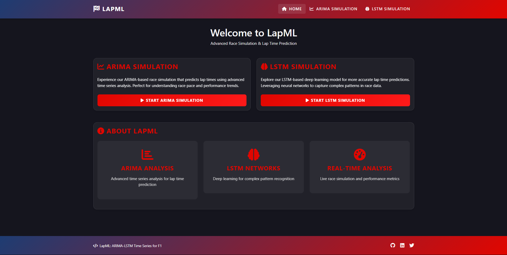
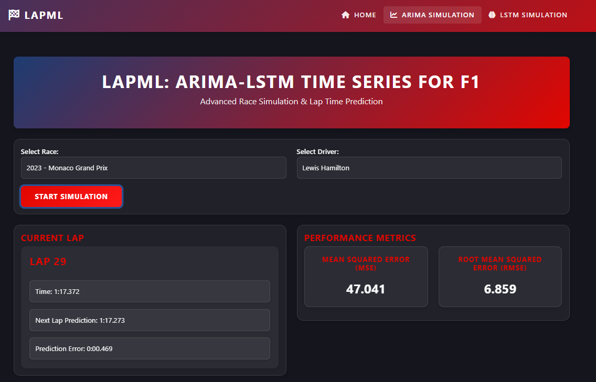
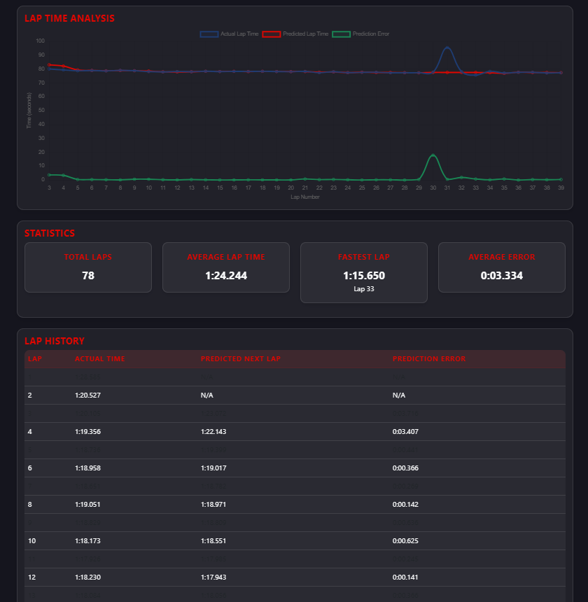
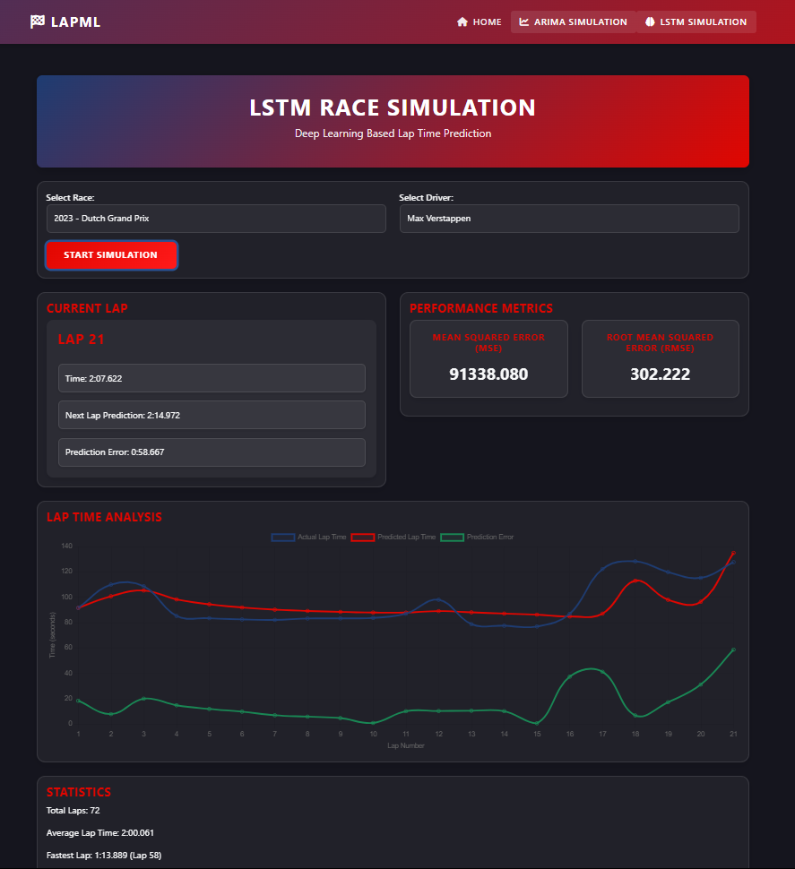

---

# 🏎️ LapML: ARIMA-LSTM Time Series Modeling for F1 Lap Prediction

LapML is a predictive analytics system built for **Formula 1 lap time forecasting** using hybrid approaches: statistical modeling (**ARIMA**) and deep learning (**LSTM**). The system simulates and predicts next lap times using real race data and provides a platform to compare model performances in a motorsport context.

---

## 📌 Project Goals

* Predict F1 driver lap times using historical data.
* Compare ARIMA vs LSTM for time series forecasting.
* Analyze error metrics and race patterns dynamically.
* Serve as a research-ready simulation for motorsport ML applications.

---

## ⚙️ How It Works

1. **Data Collection**
   Lap times are retrieved from the **Ergast API** or a local database and converted to seconds.

2. **Modeling & Prediction**

   * **ARIMA** handles sequential forecasting with AIC-based tuning.
   * **LSTM** is trained on windowed lap data using a lookback mechanism.
   * From lap 16 onward, both models are used for side-by-side comparison.

3. **Evaluation & Output**
   Metrics like **RMSE**, **MSE**, **MAE**, and **prediction error %** are computed and visualized.

---

## 🔧 Installation

```bash
# Clone the repository
git clone https://github.com/yourusername/LapML.git
cd LapML

# Create a virtual environment
python -m venv venv
source venv/bin/activate   # On Windows use venv\Scripts\activate

# Install required packages
pip install -r requirements.txt

# Run the Django server
python manage.py runserver
```

> Note: Ensure you have Python 3.8+ and pip installed.

---

## 🚀 Usage

1. Visit `http://127.0.0.1:8000/lstm_simulation/`
2. Select a race and driver combination.
3. View real-time model predictions (ARIMA vs LSTM).
4. Analyze lap-wise predictions, actual values, and metrics.
5. Export results for future research.

---

## 🧪 Model Comparison

| Feature       | ARIMA                        | LSTM                           |
| ------------- | ---------------------------- | ------------------------------ |
| Type          | Statistical (AutoRegressive) | Deep Learning (Recurrent NN)   |
| Best For      | Stationary sequences         | Non-linear, long-term patterns |
| Requires      | Small, clean datasets        | Large historical datasets      |
| In LapML Used | Lap 10+ onward               | Lap 16+ onward                 |

---

## 📈 Results Summary

* **ARIMA** yields decent short-term forecasts but lacks adaptability to racing dynamics.
* **LSTM** adapts to trends better but needs enough data (15+ laps) and training time.
* A **hybrid approach** using average + model-based predictions ensures smooth accuracy.

---

## 📷 Screenshots


 
 
 
 

---

## 💡 Future Enhancements

* Use **telemetry data** (speed, tire wear, pit stops).
* Introduce **transformer-based models** like Time Series Transformers.
* Host live dashboards for real-time F1 events.
* Add weather-based feature engineering.

---

## 🧠 Tech Stack

* **Backend:** Django, Python 3.9
* **ML Libraries:** scikit-learn, PyTorch, statsmodels
* **API:** Ergast Developer API
* **Visualization:** Chart.js, Plotly

---

## 📂 Directory Structure

```
LapML/
├── lapml/
│   ├── views.py
│   ├── models.py
│   ├── utils/
│   │   ├── lstm_utils.py
│   │   └── arima_utils.py
├── templates/
│   └── race/lstm_simulation.html
├── static/
│   └── charts/
└── screenshots/
    ├── ss1.png
    ├── ss2.png
    ├── ss3.png
    └── ss4.png
```

---

## 👨‍💻 Author

Developed by **\[Your Name]**, Computer Science student at Vishwakarma University, 2025.
A project under *Lap Time Forecasting* and *Time Series ML for Motorsport*.
